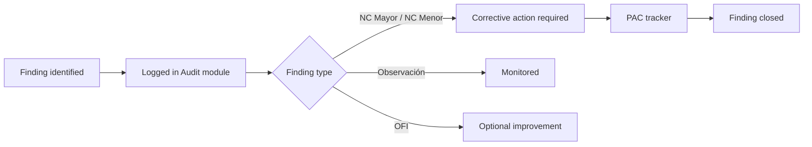

The Audit module lets you record findings identified during internal audits and monitor their status through a two-panel layout: a finding entry form on the left and a live findings tracker on the right.

<Info>
  ISOwl's audit workflow follows **ISO 19011** — Guidelines for auditing management systems.
</Info>

## Finding types

Every audit finding is classified into one of four types defined by ISO 19011:

<Columns cols={2}>
  <Card title="NC Mayor" icon="circle-xmark" color="#EF4444">
    **Non-Conformity Major** — A significant failure to meet a requirement that puts the management system or its objectives at risk.
  </Card>
  <Card title="NC Menor" icon="triangle-exclamation" color="#F97316">
    **Non-Conformity Minor** — A limited or isolated failure to meet a requirement that does not undermine the system as a whole.
  </Card>
  <Card title="Observación" icon="eye" color="#EAB308">
    **Observation** — A situation that, while not yet non-conforming, could deteriorate and become a non-conformity if left unaddressed.
  </Card>
  <Card title="OFI" icon="lightbulb" color="#3B82F6">
    **Opportunity for Improvement** — A positive suggestion to enhance effectiveness, even though no requirement is violated.
  </Card>
</Columns>

## Logging a new finding

<Steps>
  <Step title="Open the Audit module">
    Navigate to **Audit** in the left sidebar. The two-column layout loads with the entry form on the left.
  </Step>
  <Step title="Fill in the finding details">
    Complete the form fields:

    | Field | Description |
    |---|---|
    | **ID** | Auto-generated identifier (e.g., `NC001`) |
    | **Type** | Select NC Mayor, NC Menor, Observación, or OFI |
    | **Date** | Date the finding was identified (`YYYY-MM-DD`) |
    | Additional fields | Description, auditor name, clause reference, and any other contextual information |
  </Step>
  <Step title="Submit the finding">
    Click **Add Finding**. The entry appears immediately in the **Findings Tracker** table on the right with status set to **Abierto** (Open).
  </Step>
</Steps>

## Findings tracker table

The tracker on the right side of the screen displays all logged findings with the following columns:

- **ID** — Unique finding reference
- **Type** — NC Mayor, NC Menor, Observación, or OFI
- **Date** — Date identified
- **Status** — Current state of the finding (`Abierto`)

<Tip>
  Use the **Corrective Action Plan (PAC)** module to track remediation progress for findings that require corrective actions. See the [Findings & Corrective Actions](/features/findings) page.
</Tip>

## Audit finding lifecycle

## Relationship with other modules

<Columns cols={2}>
  <Card title="Corrective Action Plan" icon="list-check" href="/features/findings">
    Promote audit findings into the PAC tracker to assign owners, set due dates, and monitor remediation progress.
  </Card>
  <Card title="Security Metrics" icon="chart-bar" href="/features/security-metrics">
    Audit findings feed into the KPIs for closure rate and overdue findings on the Security Metrics dashboard.
  </Card>
</Columns>

## Frequently asked questions

<AccordionGroup>
  <Accordion title="Can I edit a finding after submitting it?">
    Audit findings logged here are immutable records. To update the remediation status or assign corrective actions, use the [Findings & Corrective Actions](/features/findings) module.
  </Accordion>
  <Accordion title="What is the difference between the Audit module and the Findings module?">
    The **Audit** module is a log for findings identified during formal internal audits. The **Findings** module (PAC) is the corrective action tracking system where you assign owners, due dates, and progress to each finding that requires remediation.
  </Accordion>
  <Accordion title="How are finding IDs assigned?">
    IDs are auto-generated sequentially (e.g., `NC001`, `NC002`) when a finding is submitted. They cannot be changed after creation.
  </Accordion>
</AccordionGroup>
