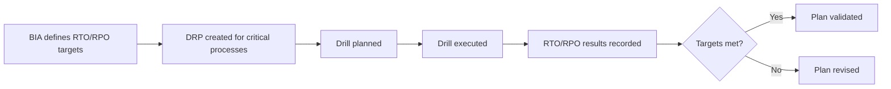

The BCP/DRP module supports your organization's business continuity and disaster recovery programs. It is organized into three tabs:

<Columns cols={3}>
  <Card title="BIA / Procesos" icon="sitemap">
    Business Impact Analysis — catalog your critical processes with RTO, RPO, and impact ratings.
  </Card>
  <Card title="Plan de Recuperación" icon="arrows-rotate">
    Disaster Recovery Plans — view recovery procedures for critical and high-impact processes.
  </Card>
  <Card title="Simulacros" icon="clipboard-list">
    Drill register — log and track the results of BCP and DRP drills.
  </Card>
</Columns>

## BIA / Procesos — Business Impact Analysis

The BIA tab displays a table of all registered business processes, their recovery objectives, impact ratings, and dependencies.

### Process fields

| Field | Description |
|---|---|
| **ID** | Process identifier (e.g., `PROC-001`) |
| **Name** | Process name |
| **RTO** | Recovery Time Objective in hours — maximum tolerable downtime |
| **RPO** | Recovery Point Objective in hours — maximum tolerable data loss |
| **Impact** | Criticality level: Crítico, Alto, Medio, or Bajo |
| **BIA** | Business impact assessment: Alto, Medio, or Bajo |
| **Owner** | Person or role responsible for the process |
| **Dependencies** | Systems, infrastructure, or teams the process depends on |

### Default processes

ISOwl ships with five pre-loaded example processes:

| ID | Process | RTO | RPO | Impact |
|---|---|---|---|---|
| PROC-001 | Operaciones de TI | 4h | 1h | Crítico |
| PROC-002 | Atención al Cliente | 8h | 4h | Alto |
| PROC-003 | Facturación y Cobros | 24h | 8h | Alto |
| PROC-004 | Recursos Humanos | 48h | 24h | Medio |
| PROC-005 | Marketing Digital | 72h | 48h | Bajo |

<Note>
  The default processes are illustrative starting points. Replace them with the actual business processes of your organization.
</Note>

### Impact levels

<Columns cols={2}>
  <Card title="Crítico" icon="circle-radiation" color="#EF4444">
    Failure of this process immediately threatens business viability. Recovery is the highest priority.
  </Card>
  <Card title="Alto" icon="triangle-exclamation" color="#F97316">
    Significant impact on operations. Recovery must begin within hours.
  </Card>
  <Card title="Medio" icon="minus-circle" color="#EAB308">
    Moderate impact. Recovery can be deferred for one to two days.
  </Card>
  <Card title="Bajo" icon="circle-info" color="#3B82F6">
    Minimal impact. Operations can continue for several days without this process.
  </Card>
</Columns>

## Plan de Recuperación — Recovery plans

The Plan de Recuperación tab displays DRP (Disaster Recovery Plan) cards automatically generated for processes rated **Crítico** or **Alto** in the BIA. Each card summarizes the recovery strategy, RTO/RPO targets, and steps to restore the process.

<Tip>
  Only processes with an impact of **Crítico** or **Alto** appear in the recovery plan tab. Ensure your BIA ratings accurately reflect the business impact of each process.
</Tip>

## Simulacros — Drill register

The Simulacros tab is a register for recording planned and completed BCP/DRP drills. Use it to track drill results and validate that your RTO and RPO targets are achievable.

### Logging a drill

<Steps>
  <Step title="Open the Simulacros tab">
    Navigate to **BCP/DRP** and select the **Simulacros** tab.
  </Step>
  <Step title="Add a new drill">
    Click **Add Simulacro** and complete the form:

    | Field | Description |
    |---|---|
    | **ID** | Auto-generated identifier (e.g., `SIM-001`) |
    | **Name** | Name of the drill (e.g., `Simulacro Ransomware`) |
    | **Type** | DRP or BCP |
    | **Date** | Scheduled or completed date (`YYYY-MM-DD`) |
    | **Status** | Planificado, En Progreso, or Completado |
    | **Result** | Summary of the drill outcome |
    | **RTO Result** | Actual recovery time achieved (hours) |
    | **RPO Result** | Actual recovery point achieved (hours) |
  </Step>
  <Step title="Save the drill record">
    Click **Save**. The drill appears in the register table.
  </Step>
</Steps>

### Drill statuses

| Status | Meaning |
|---|---|
| **Planificado** | Drill is scheduled but has not yet taken place |
| **En Progreso** | Drill is currently underway |
| **Completado** | Drill has been completed and results are recorded |

### Default drills

ISOwl includes three example drill records:

| ID | Name | Type | Date | Status | RTO Result | RPO Result |
|---|---|---|---|---|---|---|
| SIM-001 | Simulacro Ransomware | DRP | 2025-11-15 | Completado | 3.5h | 0.75h |
| SIM-002 | Evacuación Sede Principal | BCP | 2025-09-20 | Completado | — | — |
| SIM-003 | Failover Base de Datos | DRP | 2026-03-01 | Planificado | — | — |

## Comparing RTO/RPO targets vs. results

After a completed drill, compare the **RTO Result** and **RPO Result** against the targets defined in the BIA to assess whether your recovery capabilities meet your objectives.

## Frequently asked questions

<AccordionGroup>
  <Accordion title="What is the difference between BCP and DRP?">
    A **Business Continuity Plan (BCP)** covers how the organization maintains critical business functions during and after a disruption, including people, processes, and facilities. A **Disaster Recovery Plan (DRP)** focuses specifically on restoring IT systems and data after a technical failure or disaster.
  </Accordion>
  <Accordion title="What are RTO and RPO?">
    **RTO (Recovery Time Objective)** is the maximum amount of time a process can be unavailable before the impact becomes unacceptable. **RPO (Recovery Point Objective)** is the maximum age of data that can be lost — in other words, how far back in time you can afford to restore from a backup.
  </Accordion>
  <Accordion title="How often should drills be conducted?">
    ISO 27001 does not prescribe a specific frequency, but best practice recommends at least one full DRP drill per year for critical processes, and a BCP drill after any significant organizational change.
  </Accordion>
  <Accordion title="Can I add processes beyond the five defaults?">
    Yes. You can add as many processes as your organization requires. The recovery plan tab will automatically include new processes rated Crítico or Alto.
  </Accordion>
</AccordionGroup>
