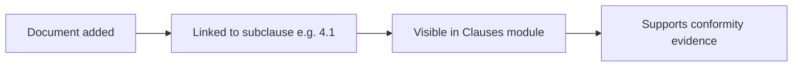

The Evidence & Document Library is a centralized repository for all documentation supporting your ISO 27001 management system. You can upload, categorize, search, and link documents directly to specific ISO 27001 subclauses.

## Document categories

Every document is assigned one of six categories:

<Columns cols={3}>
  <Card title="Política" icon="file-shield">
    Information security policies and top-level directives.
  </Card>
  <Card title="Procedimiento" icon="file-lines">
    Step-by-step operational procedures.
  </Card>
  <Card title="Registro" icon="file-pen">
    Completed records and logs that demonstrate conformity.
  </Card>
  <Card title="Evidencia" icon="file-check">
    Supporting evidence collected during audits or reviews.
  </Card>
  <Card title="Manual" icon="book-open">
    Manuals and reference documents.
  </Card>
  <Card title="Acta" icon="file-signature">
    Meeting minutes and formal agreements.
  </Card>
</Columns>

The top of the Evidence page shows **summary cards** with the total document count for each category so you can quickly assess coverage.

## Adding a document

<Steps>
  <Step title="Open the Evidence module">
    Navigate to **Evidence** in the left sidebar.
  </Step>
  <Step title="Click Add Document">
    Select **Add Document** to open the document entry modal.
  </Step>
  <Step title="Fill in the document details">
    Complete the required fields in the modal:

    | Field | Description |
    |---|---|
    | **Name** | Document title (e.g., `Política de Seguridad de la Información`) |
    | **Category** | Select from the six document categories |
    | **Description** | Brief summary of the document's purpose |
    | **Related to** | Link to a specific ISO 27001 subclause (e.g., `4.1`) |
    | **Version** | Document version number (e.g., `1.0`) |
    | **File name** | Name of the physical file, if applicable |
  </Step>
  <Step title="Save the document">
    Click **Save**. The document appears in the library and the category summary card updates its count.
  </Step>
</Steps>

<Note>
  ISOwl stores document metadata and subclause links. File upload stores the file name reference. Ensure you maintain the actual document files in your organization's file management system.
</Note>

## Searching and filtering

The library provides two ways to narrow down documents:

- **Search by name** — Type in the search bar to filter documents by their title in real time.
- **Filter by category** — Use the category dropdown to display only documents of a specific type.

Both filters can be combined to quickly locate a specific document.

## Deleting a document

To delete a document, hover over its row in the library table. A trash icon appears on the right side of the row. Click it to remove the document.

<Warning>
  Users with the **AUDITOR** role cannot delete documents. Only users with Editor or Administrator roles can remove records from the library.
</Warning>

## Linking documents to ISO 27001 clauses

Each document can be linked to a subclause of ISO 27001 via the **Related to** field. This creates a traceable connection between your documentation and the specific requirements it satisfies.

<Tip>
  Link each policy or procedure to its primary ISO 27001 subclause. This makes it straightforward to demonstrate documentary evidence during audits.
</Tip>

## Document data reference

Each document record contains the following fields:

| Field | Type | Example |
|---|---|---|
| `id` | string | `EV001` |
| `name` | string | `Política de Seguridad de la Información` |
| `category` | string | `Política` |
| `description` | string | Brief description |
| `relatedTo` | string | `4.1` |
| `fileName` | string | `politica-seguridad-v1.pdf` |
| `version` | string | `1.0` |
| `uploadedAt` | ISO date | `2025-01-15T10:30:00.000Z` |

## Frequently asked questions

<AccordionGroup>
  <Accordion title="How many documents can I store in the library?">
    There is no hard limit on the number of document records. The summary cards update automatically as you add or remove documents.
  </Accordion>
  <Accordion title="Can I link a document to more than one subclause?">
    Each document record is linked to a single subclause via the **Related to** field. If a document is relevant to multiple subclauses, add it as separate records with distinct IDs.
  </Accordion>
  <Accordion title="Why can't I see the delete button?">
    Delete is only available on hover for users with Editor or Administrator roles. Auditor-role users do not have delete permissions and will not see the trash icon.
  </Accordion>
  <Accordion title="Does the library count toward Security Metrics?">
    Yes. The **Base Documental** KPI on the [Security Metrics](/features/security-metrics) dashboard reflects the total count of records in the Evidence library.
  </Accordion>
</AccordionGroup>
