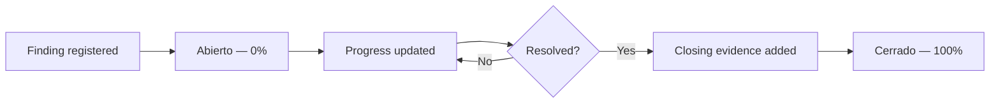

The Findings module is ISOwl's **Corrective Action Plan (PAC)** tracker. It gives you a structured workflow to register non-conformities and opportunities for improvement, assign owners, set deadlines, track progress, and close findings with closing evidence.

<Info>
  The Findings module is separate from the [Audit module](/features/audit). The Audit module is a log for findings identified during formal internal audits. The Findings module is where you manage the full remediation lifecycle.
</Info>

## Finding statuses

<Columns cols={2}>
  <Card title="Abierto" icon="circle-dot" color="#F97316">
    The finding has been registered and corrective action is in progress.
  </Card>
  <Card title="Cerrado" icon="circle-check" color="#22C55E">
    The finding has been resolved and closing evidence has been recorded. Progress is set to 100%.
  </Card>
</Columns>

## Registering a new finding

<Steps>
  <Step title="Navigate to Findings">
    Open the **Findings** module from the left sidebar.
  </Step>
  <Step title="Click Add Finding">
    Select **Add Finding** to open the registration form.
  </Step>
  <Step title="Complete the finding details">
    Fill in the required information:

    | Field | Description |
    |---|---|
    | **ID** | Auto-generated identifier (e.g., `HAL-001`) |
    | **Type** | NC Mayor, NC Menor, Observación, or OFI |
    | **Requirement** | ISO 27001 clause or subclause reference (e.g., `4.1`) |
    | **Description** | Clear description of the finding |
    | **PAC** | Corrective action plan — what will be done to resolve it |
    | **Responsible** | Person or team accountable for resolution |
    | **Due date** | Target completion date (`YYYY-MM-DD`) |
  </Step>
  <Step title="Submit">
    Click **Save**. The finding is created with status **Abierto** and progress at **0%**.
  </Step>
</Steps>

## Updating a finding

As remediation work progresses, update the finding to reflect current status:

<Steps>
  <Step title="Locate the finding">
    Find the finding in the PAC tracker table.
  </Step>
  <Step title="Edit the finding">
    Click the edit control on the finding row to open the update form.
  </Step>
  <Step title="Update fields">
    You can update the following fields:

    - **Progress** — Percentage complete (0–100)
    - **Responsible** — Reassign if ownership changes
    - **Due date** — Extend or bring forward the deadline
    - **PAC** — Refine the corrective action description
    - **Closing evidence** — Document or reference to evidence of resolution
  </Step>
  <Step title="Save changes">
    Click **Save**. The tracker table reflects the updated values immediately.
  </Step>
</Steps>

<Tip>
  Update the **Progress** field regularly to keep your closure rate KPI accurate on the [Security Metrics](/features/security-metrics) dashboard.
</Tip>

## Closing a finding

<Steps>
  <Step title="Confirm resolution">
    Before closing, ensure the corrective action has been implemented and closing evidence is documented.
  </Step>
  <Step title="Add closing evidence">
    Enter a reference to the closing evidence (e.g., a document ID, test result, or meeting minute) in the **Closing evidence** field.
  </Step>
  <Step title="Click Close Finding">
    Select the **Close Finding** action. ISOwl automatically sets:
    - Status → **Cerrado**
    - Progress → **100%**
    - Closed at → current timestamp
  </Step>
</Steps>

<Warning>
  Closing a finding is a permanent action. Once a finding is marked **Cerrado**, its status and progress cannot be rolled back through the UI.
</Warning>

## Finding lifecycle

## Finding types and required actions

| Type | Description | Corrective action required? |
|---|---|---|
| **NC Mayor** | Major non-conformity | Yes — mandatory corrective action |
| **NC Menor** | Minor non-conformity | Yes — corrective action required |
| **Observación** | Observation | Recommended — monitor closely |
| **OFI** | Opportunity for improvement | Optional |

## Findings data reference

Each finding record contains the following fields:

| Field | Type | Example |
|---|---|---|
| `id` | string | `HAL-001` |
| `type` | string | `NC Mayor` |
| `requirementId` | string | `4.1` |
| `description` | string | Finding description |
| `pac` | string | Corrective action plan |
| `responsible` | string | `Ana García` |
| `dueDate` | string | `2025-12-31` |
| `progress` | number | `0`–`100` |
| `closingEvidence` | string | Evidence reference |
| `status` | string | `Abierto` \| `Cerrado` |
| `createdAt` | ISO date | `2025-01-15T10:30:00.000Z` |

## Frequently asked questions

<AccordionGroup>
  <Accordion title="What is the difference between Findings and Audit findings?">
    The [Audit module](/features/audit) is an immutable log of findings identified during formal internal audits. The Findings module is the active corrective action tracker where you manage the full remediation lifecycle — assigning owners, setting deadlines, tracking progress, and recording closure evidence.
  </Accordion>
  <Accordion title="How does progress affect Security Metrics?">
    The **Tasa de Cierre** (closure rate) KPI on the Security Metrics dashboard is calculated from the ratio of closed findings to total findings. Keeping progress updated ensures an accurate picture of your remediation health.
  </Accordion>
  <Accordion title="What counts as an overdue finding?">
    A finding is counted as overdue (**Hallazgos Vencidos**) when its due date has passed and its status is still **Abierto**. The Security Metrics dashboard shows a count of overdue open findings.
  </Accordion>
  <Accordion title="Can I filter findings by type or status?">
    Yes. The PAC tracker table supports filtering by finding type and status to help you focus on the most critical items.
  </Accordion>
</AccordionGroup>
