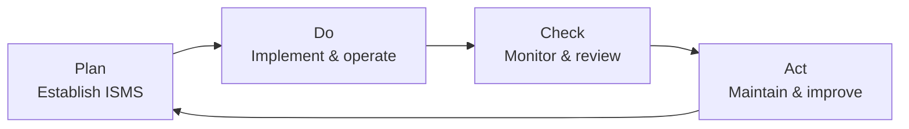

ISO/IEC 27001:2022 is the international standard that specifies the requirements for establishing, implementing, maintaining, and continually improving an **Information Security Management System (ISMS)**. It is published jointly by the International Organization for Standardization (ISO) and the International Electrotechnical Commission (IEC).

ISOwl is built to help organisations document and demonstrate conformance with ISO 27001:2022.

## What is an ISMS?

An Information Security Management System is a systematic approach to managing sensitive information so that it remains secure. It encompasses people, processes, and technology within a defined scope, and requires:

- Identifying information security risks
- Selecting and implementing controls to treat those risks
- Monitoring and measuring the effectiveness of those controls
- Continually improving the system based on performance data

An ISMS is not a single product or technology — it is a management framework.

## The Plan-Do-Check-Act cycle

ISO 27001 is built around the **Plan-Do-Check-Act (PDCA)** continual improvement model:

| Phase | ISO 27001 activities | ISOwl support |
|---|---|---|
| Plan | Define scope, conduct risk assessment, select controls | Clauses 4–6, Risk Management, Annex A |
| Do | Implement controls, train staff, manage documentation | Clauses 7–8, Evidence, Asset Management |
| Check | Internal audits, performance measurement, management review | Clause 9, Audit, Dashboard |
| Act | Correct nonconformities, drive improvement | Clause 10, Findings |

## Standard structure

ISO 27001 consists of ten clauses. Clauses 1–3 are introductory. Clauses 4–10 are normative (mandatory) and contain all the **shall** requirements. Annex A is a normative reference to ISO 27002.

| Clause | Title | Normative |
|---|---|---|
| 1 | Scope | No |
| 2 | Normative references | No |
| 3 | Terms and definitions | No |
| 4 | Context of the organisation | Yes |
| 5 | Leadership | Yes |
| 6 | Planning | Yes |
| 7 | Support | Yes |
| 8 | Operation | Yes |
| 9 | Performance evaluation | Yes |
| 10 | Improvement | Yes |
| Annex A | Information security controls reference | Yes |

## ISOwl feature mapping

Every normative clause and Annex A maps to one or more ISOwl modules:

| Clause | Name | ISOwl feature |
|---|---|---|
| 4 | Context of the organisation | [Clauses 4–10](/features/clauses) — Clause 4 section |
| 5 | Leadership | [Clauses 4–10](/features/clauses) — Clause 5 section |
| 6 | Planning | [Clauses 4–10](/features/clauses) — Clause 6 section + [Risk Management](/features/risk-management) |
| 7 | Support | [Clauses 4–10](/features/clauses) — Clause 7 section + [Evidence](/features/evidence) |
| 8 | Operation | [Clauses 4–10](/features/clauses) — Clause 8 section |
| 9 | Performance evaluation | [Clauses 4–10](/features/clauses) — Clause 9 section + [Audit](/features/audit) |
| 10 | Improvement | [Clauses 4–10](/features/clauses) — Clause 10 section + [Findings](/features/findings) |
| Annex A | Controls reference | [Annex A](/features/annex-a) |

## Clauses 4–10: requirement tracking

ISOwl tracks conformance at the **requirement** level within each clause. The [Clauses catalog](/reference/clauses-catalog) defines the full three-level hierarchy (Clause → Subclause → Requirement). Each requirement can be assigned:

- A conformance **status** (e.g. Not started, In Progress, Implemented, Not applicable)
- A **maturity** level from 0 to 5
- An **owner** and **last review date**
- Free-text **notes**

The [Executive Dashboard](/features/dashboard) aggregates these states to produce the global compliance percentage shown on the dashboard.

## Annex A

Annex A of ISO 27001 contains a normative list of 93 information security controls, organized into four themes. Organisations must reference these controls during their risk treatment process and produce a **Statement of Applicability (SoA)** that declares which controls are applicable and why.

Annex A is a reference to **ISO 27002:2022**, which provides implementation guidance for each control.

<Columns cols={2}>
  <Card title="Annex A controls" icon="shield-check" href="/features/annex-a">
    Evaluate and track all 93 ISO 27002:2022 controls within ISOwl's Annex A module.
  </Card>
  <Card title="SoA export" icon="file-export" href="/reports/soa-export">
    Export your Statement of Applicability as a structured document.
  </Card>
</Columns>

## Certification

ISO 27001 certification is granted by an accredited certification body (CB) after a two-stage audit:

1. **Stage 1** — Documentation review: the auditor reviews your ISMS documentation to confirm it meets the standard's requirements.
2. **Stage 2** — Conformance audit: the auditor verifies that your ISMS is operating effectively in practice.

ISOwl does not manage the certification process itself, but it provides the documentation, evidence register, audit records, and findings tracking needed to prepare for both audit stages.

<Note>
  ISO 27001 certification requires an external audit by an accredited body. ISOwl supports your preparation and ongoing conformance — it does not replace the formal certification process.
</Note>

## Related references

<Columns cols={2}>
  <Card title="ISO 27002" icon="book" href="/reference/iso-27002">
    The companion implementation guidance standard that defines each of the 93 Annex A controls.
  </Card>
  <Card title="ISO 31000" icon="book" href="/reference/iso-31000">
    The risk management standard that underpins ISOwl's risk assessment methodology.
  </Card>
  <Card title="Clauses catalog" icon="list-check" href="/reference/clauses-catalog">
    Technical reference for the `ISO_27001_CLAUSES` data structure.
  </Card>
  <Card title="ISO controls" icon="shield-check" href="/reference/iso-controls">
    Technical reference for the `ISO_CONTROLS` array and domain structure.
  </Card>
</Columns>
