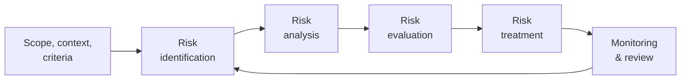

ISOwl's risk management module is aligned with two complementary international standards: **ISO 31000:2018** for general risk management principles and **ISO 27005:2022** for information security-specific risk management.

## ISO 31000:2018 — Risk management

ISO 31000:2018 provides universal principles and guidelines for risk management. Unlike ISO 27001, it is not a certifiable standard — it is a framework that any type and size of organisation can adapt.

### Core principles

ISO 31000 defines eleven principles for effective risk management. The most relevant to ISOwl's implementation are:

| Principle | Description |
|---|---|
| Integrated | Risk management is embedded in all activities, not treated as a separate function |
| Structured and comprehensive | A consistent, structured approach produces comparable and reliable results |
| Customized | The framework and process are tailored to the organisation's context |
| Inclusive | Stakeholder involvement ensures that knowledge and perspectives are considered |
| Dynamic | Risk management anticipates, detects, and responds to change |
| Best available information | Decisions are based on historical data, expert judgement, and stakeholder input |
| Continually improving | Organisations improve their risk management maturity over time |

### The risk management process

ISO 31000 defines a five-step risk management process:

| Step | ISO 31000 activity | ISOwl implementation |
|---|---|---|
| Scope, context, criteria | Define risk criteria and scoring scales | 1–5 likelihood and impact scales |
| Risk identification | Identify threats, vulnerabilities, and assets | Asset + threat + vulnerability fields in the risk form |
| Risk analysis | Calculate inherent risk | `inherentRisk = likelihood × impact` |
| Risk evaluation | Classify risk severity | 5×5 heat map with colour-coded zones |
| Risk treatment | Select and apply treatment option | Mitigate, Accept, Transfer, or Avoid |
| Monitoring and review | Track residual risk after treatment | `residualRisk = residualLikelihood × residualImpact` |

### Treatment options

ISO 31000 defines four standard risk treatment strategies. ISOwl surfaces all four as selectable options in the risk registration form:

| Treatment | ISO 31000 term | Description |
|---|---|---|
| Mitigate | Risk modification | Reduce likelihood or impact through controls |
| Accept | Risk retention | Acknowledge the risk and take no action |
| Transfer | Risk sharing | Shift the risk to a third party (insurance, outsourcing) |
| Avoid | Risk avoidance | Eliminate the activity that causes the risk |

## ISO 27005:2022 — Information security risk management

ISO/IEC 27005:2022 provides guidance specifically for managing information security risks in alignment with ISO 27001. It elaborates on the risk management process from ISO 31000 with information security-specific detail.

### Key concepts from ISO 27005

| Concept | Description | ISOwl field |
|---|---|---|
| Asset | Something of value to the organisation | `assetId` / `assetName` |
| Threat | Potential cause of an unwanted incident | `threat` |
| Vulnerability | Weakness that could be exploited by a threat | `vulnerability` |
| Likelihood | Probability that a risk event will occur | `likelihood` (1–5) |
| Impact | Consequence of a risk event occurring | `impact` (1–5) |
| Inherent risk | Risk level before controls are applied | `inherentRisk = likelihood × impact` |
| Residual risk | Remaining risk after treatment | `residualRisk = residualLikelihood × residualImpact` |
| Risk treatment | Action to modify risk | `treatment` (Mitigate, Accept, Transfer, Avoid) |

### Clause 6 integration

ISO 27001 Clause 6.1 requires organisations to define a risk assessment process and risk treatment plan. ISOwl's risk module is embedded directly within Clause 6 of the [Clauses 4–10](/features/clauses) module. Risks added from Clause 6 and from the standalone [Risk Management](/features/risk-management) page share the same data source.

## ISOwl's risk scoring model

ISOwl uses a **5×5 risk matrix** consistent with the quantitative approach described in ISO 27005.

### Scoring scale

| Score | Likelihood | Impact |
|---|---|---|
| 1 | Very unlikely | Negligible |
| 2 | Unlikely | Minor |
| 3 | Possible | Moderate |
| 4 | Likely | Significant |
| 5 | Very likely | Severe |

### Heat map zones

Risk scores (likelihood × impact) are mapped to severity zones on the heat map:

| Score range | Colour | Severity | Recommended action |
|---|---|---|---|
| 1–4 | Green | Low | Monitor — no immediate action required |
| 5–9 | Yellow | Medium | Review treatment strategy |
| 10–14 | Orange | High | Prioritise treatment — assign responsible owner |
| 15–25 | Red | Critical | Immediate action required |

### Inherent vs. residual risk

ISOwl captures risk at two points:

1. **Inherent risk** — the raw risk level before any controls or treatment are applied. Calculated as `likelihood × impact`.
2. **Residual risk** — the remaining risk after the treatment strategy and any mitigating controls are in place. Calculated as `residualLikelihood × residualImpact`.

The heat map plots **residual risk** positions, giving you a realistic picture of your current exposure after controls are accounted for.

<Tip>
  When the residual risk score remains in the orange or red zone after treatment, revisit the mitigation control. Either the control is insufficient, or the residual scores need to be reassessed against actual control effectiveness.
</Tip>

## Related ISO standards

<Columns cols={2}>
  <Card title="ISO 19011:2018" icon="clipboard-check">
    Guidelines for auditing management systems. ISOwl's internal audit module is aligned with ISO 19011 audit principles, including audit planning, conducting, and reporting.
  </Card>
  <Card title="ISO 27001" icon="book" href="/reference/iso-27001">
    The ISMS specification standard. Clause 6.1 requires the risk assessment and treatment process that ISOwl's risk module implements.
  </Card>
</Columns>

## Related ISOwl modules

<Columns cols={2}>
  <Card title="Risk management" icon="triangle-exclamation" href="/features/risk-management">
    User-facing documentation for the risk register and heat map.
  </Card>
  <Card title="Asset management" icon="server" href="/features/asset-management">
    Assets are the starting point for risk identification. Build your inventory before registering risks.
  </Card>
  <Card title="Findings" icon="flag" href="/features/findings">
    Track corrective actions for risks that generate nonconformities or audit findings.
  </Card>
  <Card title="Store reference" icon="database" href="/reference/store">
    Technical reference for `addRisk()` and the full risk data shape in the Zustand store.
  </Card>
</Columns>
